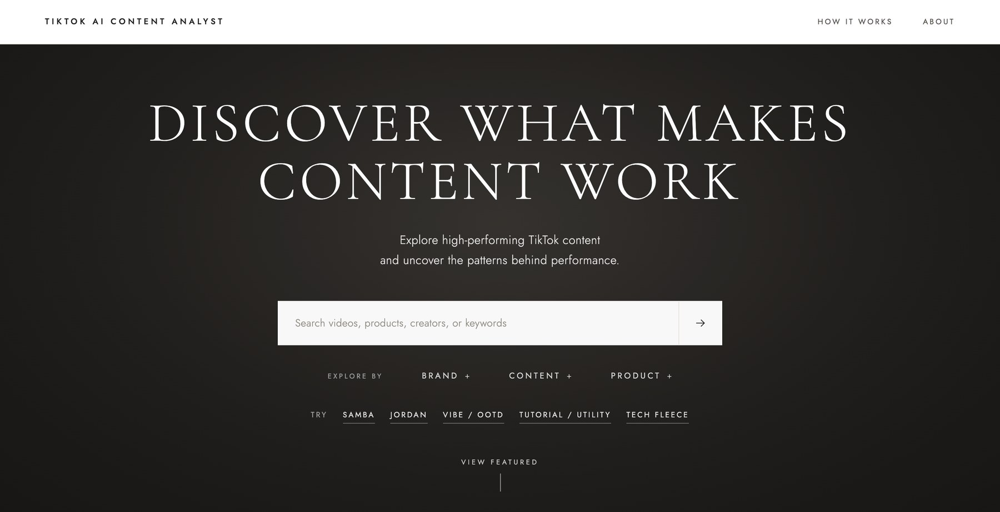
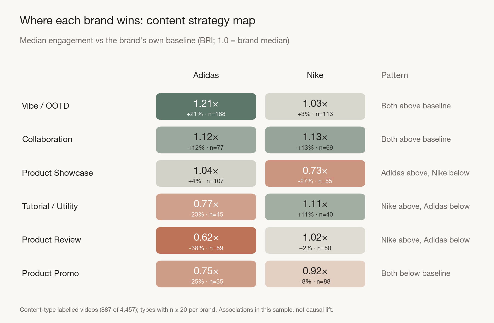
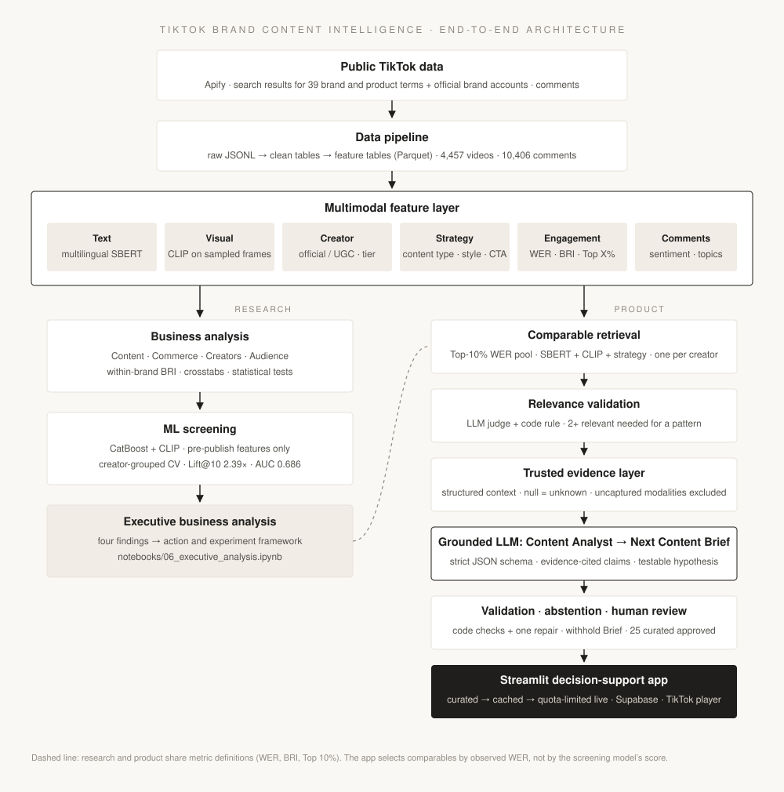
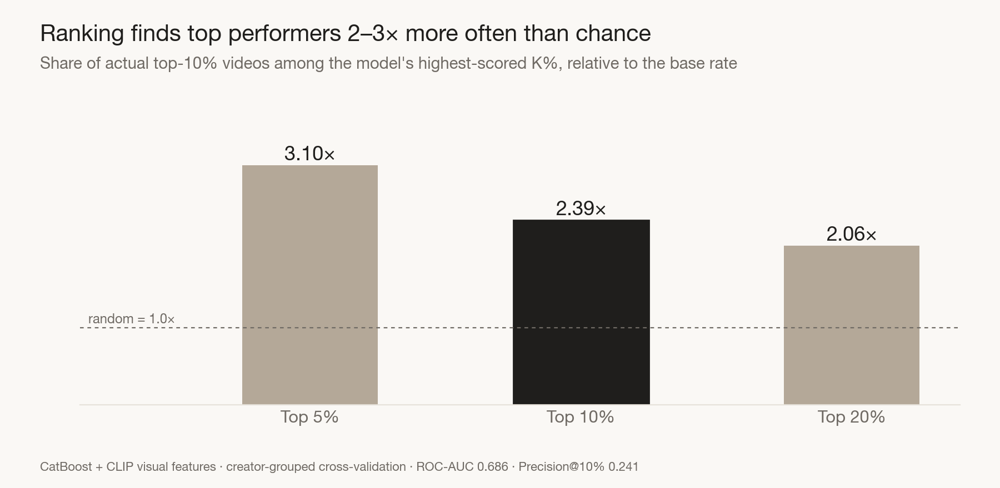
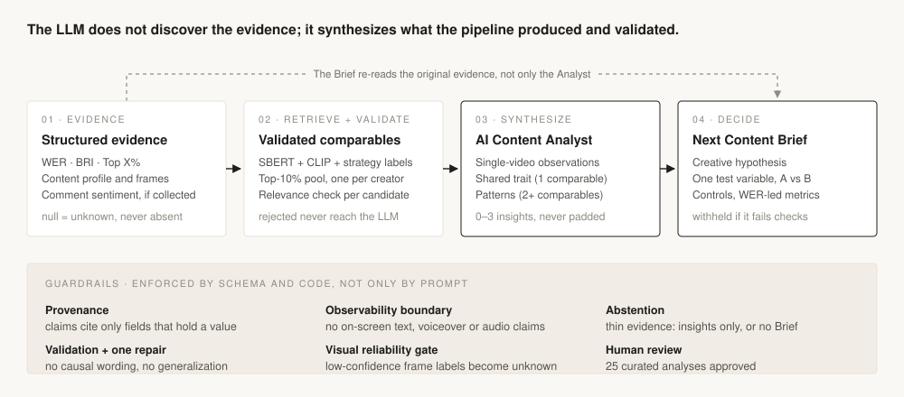
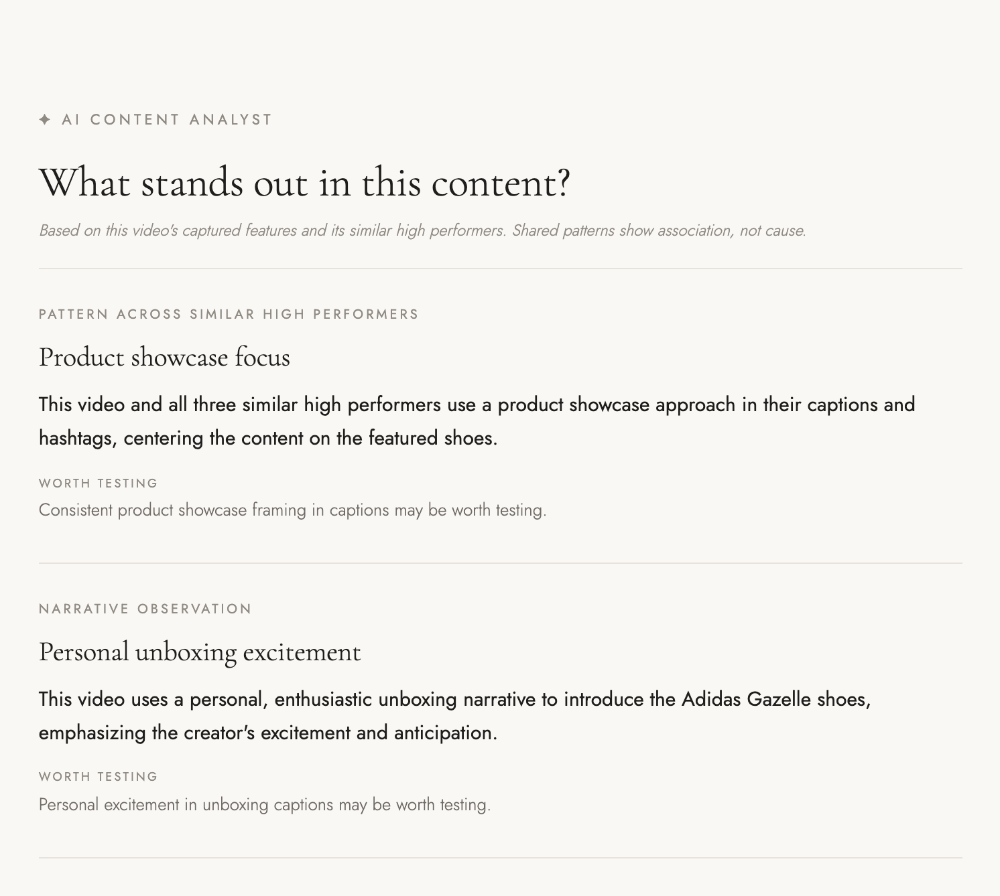
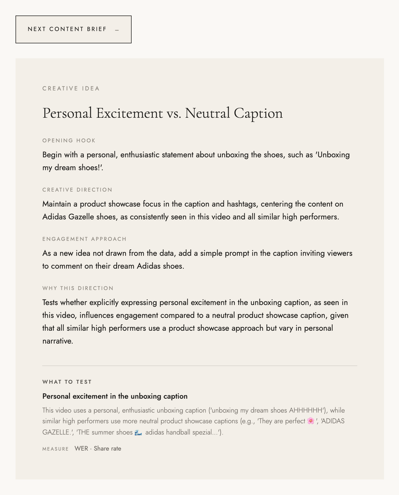

# TikTok Brand Content Intelligence: From Business Analysis to Grounded AI

### Turning 4,457 public Nike & Adidas TikTok videos into evidence-backed content insights and testable creative directions

An end-to-end content intelligence system that combines business analysis, predictive screening, multimodal retrieval and grounded LLM synthesis to find where high-performing content concentrates, surface patterns that recur across validated comparables, and turn them into what to test next.

<sub>Built with Python · NLP & Sentiment · Multimodal ML (SBERT + CLIP) · CatBoost · Grounded LLM (OpenAI API) · Streamlit · Supabase</sub>

**4,457 videos** · **4 business lenses** · **2.39× Lift@10** · **25 human-reviewed AI analyses** · **live product**

**🌐 [Live Demo](https://tiktok-brand-analytics.streamlit.app/)** · **▶ [Watch Demo](https://youtu.be/1ZC_xYpYzi0)** · **📊 [Executive Business Analysis](notebooks/06_executive_analysis.ipynb)** · **ⓘ [Methodology & Docs](docs/README.md)**

<p align="center">
  <a href="https://tiktok-brand-analytics.streamlit.app/"></a>
</p>

---

## Project at a Glance

**The problem.** Brand teams can see views and likes, but those numbers alone don't say which content territories deserve investment, whether selling harder helps, which creator and content combinations are promising, what audiences are reacting to, or which past posts are useful references for the next one.

**The solution.** A decision-support workflow that moves from descriptive analytics → predictive screening → comparable retrieval → grounded AI synthesis → a testable creative brief, delivered as an interactive app.

| | |
| --- | --- |
| **Data** | 4,457 public videos from TikTok search (39 brand and product terms) and official brand accounts; 10,406 comments on 105 high-engagement videos |
| **Analysis** | Four business lenses: content, commerce, creators, audience response |
| **ML** | Pre-publish screening model: top-10% candidates surfaced at 2.39× the base rate |
| **Product** | Streamlit app with multimodal retrieval, an evidence-checked AI Content Analyst and a Next Content Brief |

## Key Business Findings

<table>
<tr>
<td width="50%" valign="top">
<sub>01 · CONTENT</sub><br>
<b>Each brand wins in a different creative territory</b><br><br>
Adidas leans lifestyle / OOTD, Nike technical / performance. Adidas Vibe / OOTD reaches <b>1.21×</b> its brand-median engagement and Nike Tutorial / Utility <b>1.11×</b>; collaboration sits above baseline for both (<b>1.12–1.13×</b>).<br><br>
<i>Implication: judge content against each brand's own baseline, not one universal format.</i>
</td>
<td width="50%" valign="top">
<sub>02 · COMMERCE</sub><br>
<b>Strong content is not simply harder-selling content</b><br><br>
<b>96.5%</b> of videos carry no explicit commerce cue. Nike is more commerce-oriented (mean intensity <b>0.050</b> vs <b>0.022</b>), but stronger commerce intensity does not consistently go with stronger engagement; some pockets (collaboration, OOTD, Air Max, Superstar) combine both.<br><br>
<i>Implication: treat commerce as a selective creative layer, not a default recipe.</i>
</td>
</tr>
<tr>
<td width="50%" valign="top">
<sub>03 · CREATORS</sub><br>
<b>Creator–content fit matters more than follower count</b><br><br>
UGC is <b>71.5%</b> of videos and has higher brand-relative engagement (median <b>1.09</b> vs <b>0.80</b>), while official accounts get more reach (~<b>130k</b> vs <b>99k</b> median views). No creator tier is strongest across content strategies; collaboration language (<b>3.3%</b> of videos) is associated with above-baseline engagement.<br><br>
<i>Implication: match the creator to the content strategy.</i>
</td>
<td width="50%" valign="top">
<sub>04 · AUDIENCE</sub><br>
<b>Perception differences are topic-specific</b><br><br>
In ~10.4k comments on 105 high-engagement videos, Adidas draws warmer conversation (<b>42.6%</b> vs <b>36.8%</b> positive; negatives close at 16.2% vs 17.6%). The useful signal is local: Adidas leads on Fit &amp; Comfort and Product Review content, but draws more Availability complaints.<br><br>
<i>Implication: diagnose response by topic and product, not one brand score.</i>
</td>
</tr>
</table>

<p align="center">
  
</p>

**→ [Explore the full Executive Business Analysis](notebooks/06_executive_analysis.ipynb)** (5–10 minute read, six decision-grade charts)

## End-to-End Architecture

<p align="center">
  
</p>

Data moves through a medallion-style pipeline: raw JSONL records → cleaned, deduplicated tables → analysis-ready Parquet feature tables. The research branch and the app share the same metric definitions; the app selects comparables by observed engagement, not by the screening model's score.

The sections below follow this diagram: the research branch first, then the product branch.

## Business Analysis

The four lenses are one decision sequence, not four dashboards:

**Earn attention** → **Carry commercial intent** → **Choose the messenger** → **Read the response**

Engagement is compared **within brand**: BRI divides a video's weighted engagement rate (WER) by its brand's median, so 1.21× means 21% above that brand's typical video. This avoids treating Adidas's higher overall engagement as proof that its content choices are better. The resulting strategy is **Observe → Compare → Hypothesize → Test**: the data does not identify a universal TikTok formula, but it does show where the next experiment should start.

Each finding traces to a supporting notebook: [01 EDA](notebooks/01_eda.ipynb) · [02 Crosstabs](notebooks/02_descriptive_crosstabs.ipynb) · [04b Commerce](notebooks/04b_theme_commerce.ipynb) · [04c Creators](notebooks/04c_theme_influencer.ipynb) · [04d Sentiment & topics](notebooks/04d_theme_sentiment.ipynb).

## ML Screening: Predicting Less, Prioritizing Better

Predicting a video's exact engagement rate barely beat a brand-median baseline (about **3%** lower error), which is too little to act on. So the question was reframed from *"what engagement will this get?"* to *"which planned posts are most worth prioritizing?"*: a ranking problem.

<p align="center">
  
</p>

**Lift@K in plain English:** among the 10% of videos the model scores highest, **24.1%** are actual top-decile performers, against a 10% base rate: **2.39×** better than picking at random. ROC-AUC is **0.686**.

- **Leakage-safe.** Pre-publish features only (creator, content strategy, caption, timing, SBERT text embeddings, CLIP visual features); all 15 post-publication engagement columns are excluded.
- **Honest validation.** Cross-validation is grouped by creator, so no account appears in both training and test, and top-10% labels are set on training folds only.
- **What moved the needle.** CatBoost was compared with XGBoost; in a modality ablation, adding CLIP visual features gave the largest single gain (Lift@10 2.03× → 2.59× on the default CatBoost model).
- **How to read it.** SHAP shows the model relies most on visual and text semantics and creator audience. These are associations used for ranking, not causal levers.

The model is a **screening and prioritization tool, not a viral-content predictor.** Details: [`03_engagement_modeling.ipynb`](notebooks/03_engagement_modeling.ipynb).

## Multimodal Comparable Retrieval

The goal is not "find the nearest embeddings" but **find historically strong examples that are comparable enough to support analysis.**

- **Who qualifies:** the top 10% by WER across both brands, with at least 100k views.
- **Who is most alike:** multilingual SBERT caption similarity (40%) + CLIP visual similarity (40%) + overlap of strategy labels such as content type, product line and brand style (20%), with a penalty when product categories conflict. Components a video lacks are dropped rather than guessed.
- **Diversity:** at most one reference per creator.
- **Relevance check:** similarity is not relevance (Jordan sneakers vs. a trip to Jordan via `#jordan`). Each candidate is judged on subject / product, narrative intent, visual presentation and creative strategy by an LLM judge plus a code rule; rejected candidates never reach the Analyst. A cross-content pattern needs at least two relevant comparables.

Cross-brand comparables are allowed when genuinely relevant; brand is not a criterion. In practice they rarely pass the relevance check.

## From Analytics to Decisions: Grounded AI

> **The LLM does not discover the evidence. It synthesizes evidence produced and retrieved by the analytical pipeline.**

<p align="center">
  
</p>

- **AI Content Analyst** separates what is true of this one video from what recurs across validated comparables: an observation, a shared characteristic (one comparable) or a pattern (two or more). It produces 0–3 insights and is never padded to a count.
- **Next Content Brief** turns supported insights into one creative hypothesis: a concept, an opening hook, a single test variable with variants A and B, controls held constant and WER-led metrics. It re-reads the original evidence and comparables alongside the Analyst's insights, so a second generation can catch an interpretation error instead of amplifying it.

<table>
<tr>
<td width="50%" valign="top"></td>
<td width="50%" valign="top"></td>
</tr>
</table>
<p align="center"><sub>The AI Content Analyst and the Next Content Brief on the same curated example: findings are tied to this video and its validated similar high performers, framed as worth testing rather than as causes, and the Brief turns them into a single testable variable.</sub></p>

## Reliability & Guardrails

Grounded does not automatically mean correct, so the controls sit in the schema and in code, not only in the prompt:

| Control | How it works |
| --- | --- |
| **Provenance** | The response schema is built per video: claims can only cite evidence fields that hold a value and comparables that passed validation. |
| **Validation** | Code rejects causal wording, generalization beyond the comparable set, performance used as justification and untraceable test variables; one repair attempt, then the item is dropped. |
| **Evidence quality** | Upstream labels are audited. Frame labels below a confidence margin are treated as unknown after review found near-random setting labels. |
| **Observability boundary** | The dataset has no on-screen text, voiceover, narration or audio, so these are never used as evidence, present or absent. |
| **Unknown ≠ absent** | Missing data is passed as unknown, and catch-all labels ("Other") are never treated as a finding. |
| **Abstention** | Thin evidence gives observations only; a Brief that fails validation is withheld and the Analyst is shown alone. |
| **Human review** | The 25 curated analyses were generated by the pipeline, never hand-written, and approved before serving (23 with a Brief, 2 insights only). |
| **Cost & failure safety** | Curated and cached outputs never call the API; live generation for other videos is capped per session and per day, and stops rather than generating if the cache or quota can't be checked. |

The full specification, including the problems review caught and how each was fixed, is in [the AI layer guide](docs/07-ai-layer.md).

## Product Experience

The Streamlit app turns the analysis into a workflow a content strategist can use on any video in the library:

**Discover** content by keyword, brand, content type and product → **Performance** against the brand's baseline (WER, BRI, Top X%) → **Content profile** from frames, caption and hashtags → **Audience signals** where comments were collected → **Similar high performers**, validated for relevance → **AI Content Analyst** → **Next Content Brief** with a test plan.

Try it: **[tiktok-brand-analytics.streamlit.app](https://tiktok-brand-analytics.streamlit.app/)**, or open a curated example directly: **[Adidas Gazelle creator showcase](https://tiktok-brand-analytics.streamlit.app/analysis?video=7465873104259009835)**. Posts play through TikTok's official player; the project does not host video files.

## Tech Stack

- **Collection & data:** Python, Apify, pandas, PyArrow / Parquet, YAML-configured taxonomy and feature rules
- **Text & visual features:** multilingual SBERT (sentence-transformers), CLIP (ViT-B/32) on sampled frames, VADER sentiment, langdetect and machine translation
- **Modeling:** scikit-learn, CatBoost, XGBoost, SHAP
- **AI layer:** OpenAI API with strict JSON schemas, code-side validators, curated registry with human QA
- **Product:** Streamlit, Supabase (persistent cache and atomic daily quota), deployed on Streamlit Community Cloud
- **Quality & ops:** pytest (59 tests), GitHub Actions keep-alive for the hosted app

## Repository Guide

```text
app/                  Streamlit app, retrieval, relevance check, AI Analyst and Brief
configs/              Search terms, accounts, taxonomy and feature rules
data/                 Local crawl outputs and processed datasets (not committed)
docs/                 Architecture, data dictionary, pipeline runbook, AI layer spec, README assets
notebooks/            Executive analysis (06) and supporting EDA, modeling and theme notebooks
scripts/              Crawlers, dataset builders, enrichment, app export, curation
src/tiktok_brand/     Reusable crawl, ETL, feature and analysis package
tests/                Unit and contract tests
```

**Reading paths:** recruiters start here; stakeholders read [`06_executive_analysis.ipynb`](notebooks/06_executive_analysis.ipynb); technical reviewers continue to the [supporting notebooks](notebooks/README.md) and [docs](docs/README.md).

## Reproduce

Requires Python 3.10+.

```bash
uv sync                              # or: python -m venv .venv && pip install -e ".[dev]"
python -m scripts.run_small_pipeline # fixture-backed run, no live crawl
PYTHONPATH=src pytest tests/ -q
streamlit run app/streamlit_app.py
```

<details>
<summary><b>Live collection, rebuild and deployment</b></summary>

**Collect and build.** Copy `.env.example` to `.env`, set `APIFY_API_TOKEN`, then:

```bash
python -m scripts.crawl_hashtags     # seed-term search (legacy name)
python -m scripts.crawl_users
python -m scripts.crawl_comments     # optional; after video collection
python -m scripts.build_dataset
make app_data                        # refresh the app's slim export
```

Live collection uses Apify actors and incurs their usage costs. First-time embedding model downloads and optional translation need network access (`BUILD_MT=0` disables translation).

**AI generation.** Live generation needs `OPENAI_API_KEY` (environment, Streamlit Secrets or local `.env`; read server-side only). Curated and cached analyses are served without it. Optional settings: `AI_DAILY_LIMIT`, `AI_SESSION_LIMIT`, `AI_LIVE_GENERATION = "off"`.

**Deploy on Streamlit Community Cloud.** Point the app at `app/streamlit_app.py`; dependencies install from `app/requirements.txt`. The host's disk is ephemeral, so to keep cached generations and the daily quota across restarts, create a Supabase project, run `scripts/supabase_setup.sql`, and add `SUPABASE_URL` and `SUPABASE_SECRET_KEY` to Secrets. Set a budget limit on the OpenAI project as the hard cost bound.

**README figures.** `python scripts/make_readme_figures.py` redraws the charts in `docs/assets/`.

</details>

## Data & Limitations

- **Collection.** Videos were collected from TikTok search results using 39 brand- and product-related seed terms, plus public videos from official brand accounts (`nike`, `jumpman23`, `adidas`). Because search results are algorithmically ranked, the sample may over-represent content that is more visible in TikTok search. It is not a random sample of TikTok.
- **Metrics.** WER is used for overall ranking; BRI gives within-brand context and is not evidence that one brand is stronger overall. "Top X%" is a WER percentile among videos with a valid WER.
- **Label coverage.** Content-type labels cover 19.9% of videos (887 of 4,457), so territory-level findings rest on that labeled subset.
- **Comments.** Sentiment comes from a subsample of 105 high-engagement videos and describes comment tone, not consumer attitude or purchase intent.
- **Inference.** Findings are descriptive associations or predictive screening, not causal lift.
- **AI layer.** Relevance judgments are not fully deterministic between fresh runs, which is why reviewed outputs are frozen. Live outputs for non-curated videos are labeled as generated on demand and not human-reviewed.
- **Privacy.** Research tables stay local. The app ships a slim export with public post metadata and embeddings (no account IDs, bios or source URLs) and per-video sentiment shares (no comment text or commenter identities).

## Disclaimer

This is an independent, non-commercial portfolio project for educational, research and data-science demonstration purposes. It is not affiliated with, sponsored by or endorsed by TikTok, ByteDance, Nike or Adidas. All trademarks belong to their respective owners. Findings are not official platform statistics or brand performance reports. See [LICENSE](LICENSE) for license terms.
