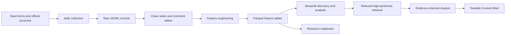

# TikTok Brand Analytics

### A research-grade content intelligence pipeline for Nike and Adidas on TikTok

From sampled public posts to structured evidence, comparable high performers, and testable creative hypotheses. This repository combines a reproducible Python data pipeline, an interactive Streamlit analyst experience, and a notebook-based research workflow.

**Python 3.10+** · **Nike × Adidas** · **Apify collection** · **Parquet analytics** · **Streamlit**

> **In one sentence:** understand what is being published, how sampled content performs, which creative patterns are worth investigating, and how to turn those observations into a testable next brief.

---

## What You Can Do

- **Explore content performance.** Compare views and engagement alongside weighted engagement rate (WER), brand-relative engagement index (BRI), and performance percentiles.
- **Profile creative strategy.** Analyze product taxonomy, content intent, calls to action, creator type and tier, visual format, and TikTok-native social mechanics.
- **Study audience language.** Enrich video captions and sampled comments with language detection, sentiment, topic signals, and multilingual text embeddings.
- **Find meaningful comparables.** Retrieve high-performing posts using text, visual, and strategy signals, then screen candidates for substantive relevance before synthesis.
- **Generate evidence-aware guidance.** The AI Content Analyst separates observations from cross-content patterns; the Next Content Brief turns supported takeaways into a creative hypothesis and experiment plan.
- **Reproduce the analysis.** Keep collection, clean-up, feature engineering, analysis notebooks, and schema checks in one versioned workflow.

## How It Fits Together



The data follows a medallion-style progression:

| Layer | Location | Purpose |
| --- | --- | --- |
| **Bronze** | `data/crawl_exports/`, `data/raw/` | Optional crawler exports and mapped JSONL video/comment records |
| **Silver** | `data/processed/clean/` | Harmonized, normalized, deduplicated facts |
| **Gold** | `data/processed/feature/` | Analysis-ready video and comment features |

The clean layer owns field normalization and record quality. The feature layer owns engagement metrics, multi-label content signals, creator attributes, taxonomy, and enrichment. This keeps source facts distinct from analytical interpretation.

## Research Dimensions

| Lens | Example signals |
| --- | --- |
| **Awareness & engagement** | Views, likes, comments, shares, saves, WER, BRI, percentile |
| **Commerce** | Purchase, discovery, promotion, and engagement calls to action |
| **Content & culture** | Rule-defined content types, product taxonomy, brand styles, social mechanics |
| **Creators** | Official account vs. UGC, follower tier, collaboration language |
| **Audience response** | Comment sentiment and topics on the collected comment sample |
| **Visual & semantic similarity** | Sampled-frame labels, text embeddings, and comparable-post retrieval |

Labels such as content type, product category, and social mechanic are multi-label where appropriate. They describe observable signals in the collected material; they are not verified commercial outcomes or causal explanations.

## Get Started

### 1. Install

Requires Python 3.10 or newer. With [uv](https://docs.astral.sh/uv/):

```bash
uv sync
```

Or use a virtual environment:

```bash
python -m venv .venv
source .venv/bin/activate
pip install -e ".[dev]"
```

### 2. Build a small local dataset

Run the fixture-backed pipeline first to validate the environment without starting a live crawl:

```bash
python -m scripts.run_small_pipeline
```

The smoke test is also available directly:

```bash
python scripts/smoke_test.py
```

### 3. Collect and process data

For live collection, copy `.env.example` to `.env` and set `APIFY_API_TOKEN`. Then run:

```bash
python -m scripts.crawl_hashtags
python -m scripts.crawl_users
python -m scripts.crawl_comments   # optional; run after video collection
python -m scripts.build_dataset
```

The app and analysis notebooks read `data/processed/feature/feature_table.parquet`. Live collection requires an Apify account and incurs usage under the configured Apify actors. Non-English sentiment translation and first-time embedding/model downloads may require network access; translation can be disabled with `BUILD_MT=0` (the default for bulk builds).

### 4. Open the analyst app

```bash
streamlit run app/streamlit_app.py
```

The app provides content discovery, performance and content profiles, similar high performers, AI insights, and a next-content brief. Live AI generation requires `OPENAI_API_KEY` and can be configured with environment variables or Streamlit Secrets. Curated or cached analyses can be served without a new generation; live generation is subject to configured quotas. See [the AI layer guide](docs/07-ai-layer.md) for behavior and guardrails.

TikTok posts are linked or shown through TikTok's player; this project does not host original video files. Locally generated data is not automatically distributed with the repository, so build or provide the feature table before using the app with a full dataset.

### 5. Run checks

```bash
PYTHONPATH=src pytest tests/ -q
```

## Analysis Notebooks

The notebooks build from data checks to reporting: shared setup → exploratory analysis → descriptive cross-tabs → engagement modeling → four themed analyses → report-facing summary. See [notebooks/README.md](notebooks/README.md) for the intended run order and interpretation of each chapter.

## Repository Map

```text
app/                  Streamlit app, retrieval, AI analysis, and content brief
configs/              Crawl seeds, sampling, taxonomy, and feature rules
data/                 Local crawl outputs and processed datasets
docs/                 Architecture, schemas, runbook, and AI-layer specification
notebooks/            EDA, modeling, themed analysis, and final summary
scripts/              Crawlers, dataset builders, enrichment, and smoke pipeline
src/tiktok_brand/     Reusable crawl, ETL, feature, and analysis package
tests/                Unit and contract tests
```

## Scope & Interpretation

This is a **sample-based, independent research project**, not a complete TikTok archive. Collection uses search results for configured brand/product seed terms and selected official accounts. Search ranking is algorithmic; observed posts depend on query, crawl time, and platform availability. A crawl records timestamps for traceability, but does not make the sample representative.

Engagement rates are noisy, and BRI compares a post with its own brand's median rather than measuring brand strength across brands. Sentiment describes the emotional tone of caption or comment text, not true consumer attitude; translation and lexicon-based sentiment add uncertainty. Analyses are descriptive or predictive screening unless explicitly stated otherwise and **do not establish causal lift**. The AI layer is designed to state missing evidence, validate comparables, avoid causal claims, and withhold unsupported insights or briefs.

Use public data responsibly, follow TikTok's terms and applicable law, and avoid retaining or publishing personal information beyond what the analysis requires.

## Documentation

- [Documentation index](docs/README.md)
- [System architecture](docs/01-architecture.md)
- [Collection sources and fields](docs/02-crawl.md)
- [Data dictionary and schema contracts](docs/03-data-dictionary.md)
- [Product taxonomy](docs/04-taxonomy.md)
- [Feature engineering and interpretation](docs/05-feature-engineering.md)
- [Pipeline runbook](docs/06-pipeline.md)
- [AI Content Analyst and Next Content Brief](docs/07-ai-layer.md)
- [Notebook run order](notebooks/README.md)

## Project Notice

This is an independent, non-commercial portfolio project for educational, research, and data-science demonstration purposes. It is not affiliated with, sponsored by, or endorsed by TikTok, ByteDance, Nike, or Adidas. All trademarks belong to their respective owners. Findings are not official platform statistics or brand performance reports. See [LICENSE](LICENSE) for license terms.
